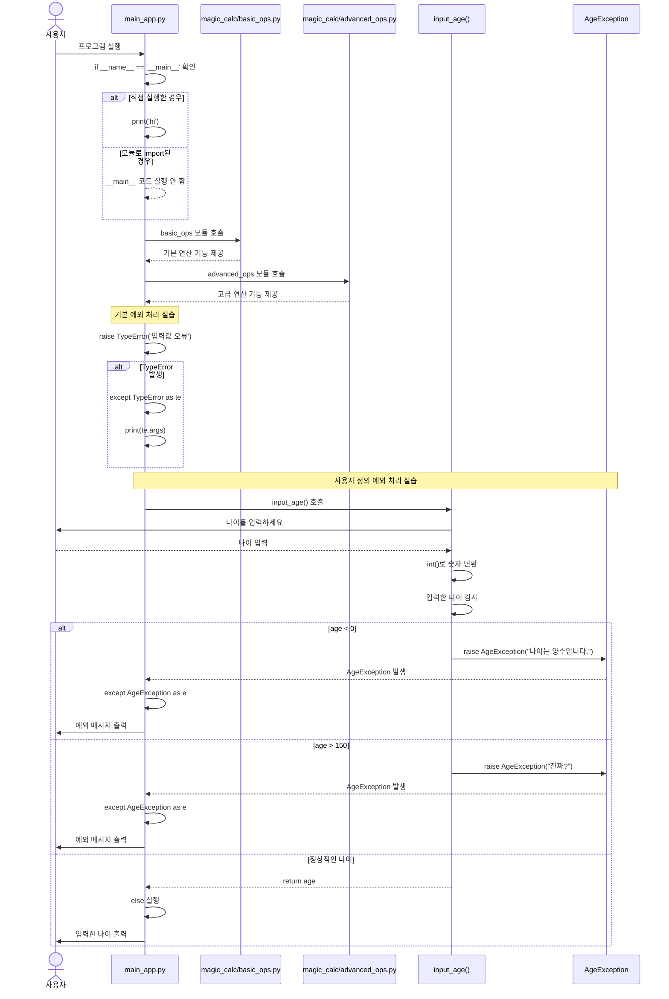

# 2026-git-start

로컬 컴퓨터에서 추가한 내용입니다.

오늘의 학습 목표 'GitHub와 로컬 저장소의 Merge 충돌 해결 실습'

GitHub 웹에서 추가한 내용입니다.

# 2026 Git Start

오늘의 학습 목표: 작업자 B의 Merge 충돌 실습

오늘의 학습 목표: 작업자 A의 Git 협업 실습

오늘의 학습 목표: 작업자 A·B의 Git 협업 및 Merge 충돌 해결

# Python 실습 과정

## 시퀀스 다이어그램



## 프로젝트 구조

```text
my_first_package/
│
├── main_app.py
│
└── magic_calc/
    ├── basic_ops.py
    └── advanced_ops.py
```

## 예외 처리 흐름

`input_age()` 함수에서 입력값을 검사하고 잘못된 나이가 입력되면
`AgeException` 예외를 발생시킨다.

발생한 예외는 `input_age()`를 호출한 부분의 `except AgeException`에서
처리한다.

정상적인 값이 입력되면 `age`를 반환하고 `else` 블록에서 결과를 출력한다.
