# 2026-git-start

로컬 컴퓨터에서 추가한 내용입니다.

오늘의 학습 목표 'GitHub와 로컬 저장소의 Merge 충돌 해결 실습'

GitHub 웹에서 추가한 내용입니다.

# 2026 Git Start

오늘의 학습 목표: 작업자 B의 Merge 충돌 실습

오늘의 학습 목표: 작업자 A의 Git 협업 실습

오늘의 학습 목표: 작업자 A·B의 Git 협업 및 Merge 충돌 해결

# GitHub Merge 충돌 해결 및 협업 실습

## 실습 과정 시퀀스 다이어그램

```mermaid
sequenceDiagram
    actor User as 사용자
    participant Web as GitHub 웹
    participant GitHub as GitHub 원격 저장소
    participant Local as 로컬 저장소
    participant A as 작업자 A 로컬
    participant B as 작업자 B 로컬

    %% =========================
    %% 1단계
    %% =========================

    Note over User,Local: 1단계 - GitHub 웹과 로컬 저장소의 Merge 충돌

    User->>GitHub: 2026-git-start 저장소 생성
    GitHub-->>User: README.md 포함 저장소 생성

    User->>Local: git clone 저장소
    GitHub-->>Local: 파일 + Commit 이력 + origin 정보 복제

    Local->>Local: git status
    Local->>Local: git remote -v

    Note over Web,Local: 동일한 README.md를 서로 다르게 수정

    User->>Web: README.md 수정
    Web->>GitHub: Commit - GitHub에서 README 수정

    User->>Local: README.md 같은 위치를 다르게 수정
    Local->>Local: git add README.md
    Local->>Local: git commit

    Local->>GitHub: git push

    GitHub-->>Local: Push 거절<br/>fetch first

    Note over GitHub,Local: 원격과 로컬에 서로 다른 Commit 존재

    Local->>GitHub: git fetch origin
    GitHub-->>Local: 최신 원격 Commit 정보 전달

    Note right of Local: origin/main은 갱신되지만<br/>local main과 작업 파일은 그대로

    Local->>Local: git log --oneline --graph --all --decorate

    Local->>Local: git merge origin/main

    Local-->>Local: README.md Merge Conflict 발생
    Note right of Local: main|MERGING

    Local->>Local: git status
    Local->>Local: README.md 충돌 표시 확인

    Note right of Local: <<<<<<< HEAD<br/>로컬 내용<br/>=======<br/>GitHub 내용<br/>>>>>>>> origin/main

    User->>Local: 최종 README.md 내용 결정
    User->>Local: 충돌 표시 삭제 및 저장

    Local->>Local: git add README.md
    Note right of Local: 충돌 해결 완료 표시

    Local->>Local: git commit -m "README 충돌 해결"
    Note right of Local: Merge Commit 생성

    Local->>GitHub: git push
    GitHub-->>Local: 충돌 해결 결과 반영 완료


    %% =========================
    %% 2단계
    %% =========================

    Note over User,B: 2단계 - 작업자 A·B 협업 및 Merge 충돌

    Note over A: 기존 /c/2026-git-start<br/>→ 작업자 A 사용

    User->>B: 같은 GitHub 저장소 Clone
    GitHub-->>B: /c/2026-git-start-b 생성

    User->>A: user.name = Worker A 설정
    User->>B: user.name = Worker B 설정

    Note over A,B: A와 B는 같은 GitHub와 연결되지만<br/>서로 독립적인 로컬 저장소


    %% 충돌 없는 협업

    Note over A,B: 1차 - 서로 다른 파일 수정

    A->>A: worker-a.md 생성
    A->>A: git add + commit
    A->>GitHub: git push

    Note right of B: A가 Push해도<br/>B의 로컬은 자동 변경되지 않음

    B->>GitHub: git fetch origin
    GitHub-->>B: A의 Commit 정보 전달
    B->>B: git merge origin/main

    B->>B: worker-a.md 반영 완료

    B->>B: worker-b.md 생성
    B->>B: git add + commit
    B->>GitHub: git push

    A->>GitHub: git fetch origin
    GitHub-->>A: B의 Commit 정보 전달
    A->>A: git merge origin/main

    Note over A,B: 서로 다른 파일 수정 → 자동 Merge 성공


    %% 충돌 실습 준비

    Note over A,B: 2차 - 같은 README.md 문장 수정

    A->>GitHub: git fetch + merge
    B->>GitHub: git fetch + merge

    Note over A,B: A와 B를 동일한 Commit 상태로 동기화

    A->>A: README.md 공통 문장 작성
    Note right of A: 오늘의 학습 목표: Git 협업 이해

    A->>A: git add + commit
    A->>GitHub: git push

    B->>GitHub: git fetch origin
    GitHub-->>B: 공통 문장 Commit 전달
    B->>B: git merge origin/main


    %% A 수정

    A->>A: README.md 같은 문장 수정
    Note right of A: 작업자 A의 Git 협업 실습

    A->>A: git add + commit
    A->>GitHub: git push

    GitHub-->>A: A 변경 반영


    %% B 수정

    B->>B: A의 변경을 받기 전에<br/>README.md 같은 문장 수정
    Note right of B: 작업자 B의 Merge 충돌 실습

    B->>B: git add + commit
    B->>GitHub: git push

    GitHub-->>B: Push 거절<br/>fetch first

    Note over A,B: A와 B의 Branch가 서로 갈라짐<br/>diverged


    %% B Fetch & Merge

    B->>GitHub: git fetch origin
    GitHub-->>B: A의 최신 Commit 정보 전달

    B->>B: git log --oneline --graph --all --decorate

    B->>B: git merge origin/main

    B-->>B: README.md Merge Conflict 발생
    Note right of B: main|MERGING

    B->>B: git status
    B->>B: README.md 충돌 내용 확인

    Note right of B: Current Change = B 로컬 내용<br/>Incoming Change = A 원격 내용

    User->>B: A와 B의 내용을 검토
    User->>B: 최종 문장 결정

    Note right of B: 오늘의 학습 목표:<br/>작업자 A·B의 Git 협업 및 Merge 충돌 해결

    User->>B: 충돌 표시 삭제 및 저장

    B->>B: git add README.md
    B->>B: git commit -m "B: A의 변경과 README 충돌 해결"

    Note right of B: Merge Commit 생성

    B->>GitHub: git push
    GitHub-->>B: 최종 Merge 결과 반영


    %% A 최종 동기화

    Note over A,GitHub: 작업자 A에는 아직 B의 Merge Commit이 없음

    A->>GitHub: git fetch origin
    GitHub-->>A: B의 최종 Merge Commit 전달

    A->>A: git merge origin/main

    A->>A: cat README.md
    A->>A: git log --oneline --graph --all --decorate

    Note over A,B: 작업자 A / 작업자 B / GitHub<br/>모두 같은 최신 Commit 상태
```



---

## 전체 실습 핵심 흐름

```text
[1단계]

GitHub 저장소 생성
        ↓
로컬 Clone
        ↓
GitHub 웹에서 README 수정
        ↓
로컬에서도 같은 부분 수정
        ↓
git push
        ↓
Push 거절
        ↓
git fetch origin
        ↓
git merge origin/main
        ↓
Merge Conflict
        ↓
충돌 내용 직접 수정
        ↓
git add
        ↓
git commit
        ↓
git push
        ↓
Merge 완료


[2단계]

같은 GitHub 저장소를 A와 B가 각각 사용
        ↓
서로 다른 파일 수정
        ↓
add → commit → push
        ↓
다른 작업자가 fetch → merge
        ↓
충돌 없이 협업 성공
        ↓
A와 B가 README 같은 문장을 다르게 수정
        ↓
A가 먼저 push
        ↓
B가 push 시도
        ↓
fetch first 오류
        ↓
B가 git fetch origin
        ↓
git merge origin/main
        ↓
README.md Merge Conflict
        ↓
B가 충돌 해결
        ↓
git add
        ↓
Merge Commit
        ↓
git push
        ↓
A가 fetch → merge
        ↓
A / B / GitHub 최종 동기화
```

---

## 핵심 개념

### `git fetch origin`

```text
GitHub의 최신 Commit 정보를 가져온다.
하지만 현재 작업 파일과 local main은 바로 변경하지 않는다.
```

### `git merge origin/main`

```text
fetch로 가져온 origin/main의 변경 내용을
현재 local main에 합친다.
```

### Merge Conflict

```text
여러 작업자가 같은 파일의 같은 부분을
서로 다르게 수정하여 Git이 자동으로
최종 내용을 결정할 수 없는 상태이다.
```

### 충돌 해결 기본 순서

```text
git fetch origin
        ↓
git merge origin/main
        ↓
충돌 파일 확인
        ↓
최종 내용 결정
        ↓
충돌 표시 삭제
        ↓
git add
        ↓
git commit
        ↓
git push
```

### 협업 시 중요한 점

```text
다른 작업자가 Push
        ↓
GitHub의 origin/main 변경
        ↓
내 local main은 자동으로 변경되지 않음
        ↓
git fetch origin
        ↓
git merge origin/main
```

즉,

> **같은 GitHub 저장소를 사용하더라도 각 작업자의 로컬 저장소는 서로 독립적이며, 다른 작업자의 변경 내용을 반영하려면 fetch와 merge 과정이 필요하다.**
